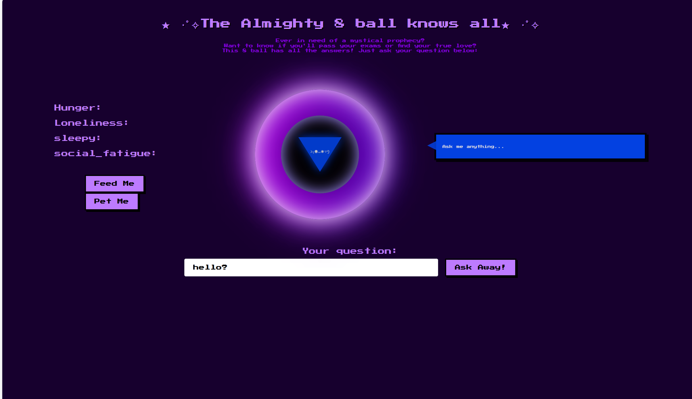

# 🐾 My 8 ball is a cat!
— A Mischievous AI Oracle

_**What if your 8 ball … was a cat?**_


>🎱 **My 8 ball is a cat!** is a playful web application built with Flask and OpenAI’s API that responds to user questions with the personality of a cat. Why? 'Cause it's a cat?

---

## ✨ Features

- 🧠 AI-powered responses using OpenAI API  
- 🐱 Cat-inspired personality (sarcastic, ready for snacks, aloof, chaotic)  
- 💬 Simple web interface for asking questions  
- 🎭 Customizable tone based on mood. (grumpy cat, hungry cat, etc.)  
- 🔄 Easily extendable prompt engineering  

---

> ⚠️ **Work in Progress** 🙀 
> I'm still developing this project. Aiming to finish it end of May 2026 latest. Come back for the full version later! 
---
## 🐱 How It Works
1. User enters a question in the web interface
2. Flask captures the input
3. The question is sent to OpenAI API
4. A custom prompt injects a cat personality 🐾
   * giving the cat food or petting the cat will influence the cat's personality.
5. The response is rendered back to the user
---
## ⚠️ Disclaimer 🙀

🎱 _**_My 8 ball is a cat!_**_  is not a reliable source of truth.

#### It is:<br/>

&nbsp;&nbsp;&nbsp;&nbsp;&nbsp;&nbsp;😻 occasionally helpful<br/>
&nbsp;&nbsp;&nbsp;&nbsp;&nbsp;&nbsp;😼frequently wrong<br/>
&nbsp;&nbsp;&nbsp;&nbsp;&nbsp;&nbsp;😽 always a cat<br/>

---

## 🖼️ Demo

Ask anything:

> “What is the meaning of life?”

8 ball might respond:

> “Probably food. Or naps. Mostly naps. Why are you asking me instead of feeding me?”

---

## 🛠️ Tech Stack

- Python  
- Flask  
- OpenAI API  
- HTML / CSS  

---

## 🚀 Getting Started

### 1. Clone the repository

```bash
git clone https://github.com/veragrosskop/My-8-ball-is-a-cat.git
cd My-8-ball-is-a-cat
```

### 2. Install dependencies
```bash
pip install -r requirements.txt
```
### 3. Run the app
```bash
python app.py
```

### 4. Open:
http://localhost:5000


